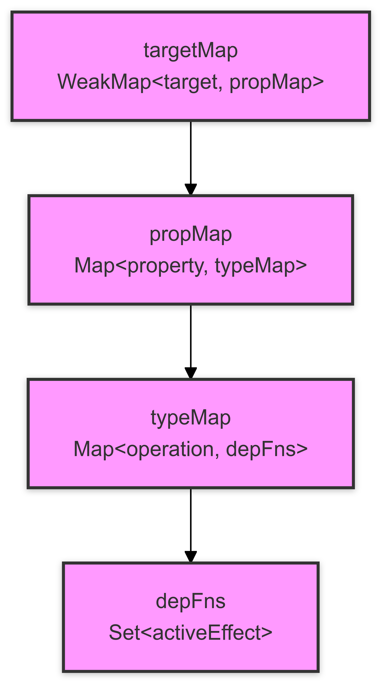

# 响应式数据结构

## 数据结构解释

### targetMap

- **类型**: `WeakMap<target, propMap>`
- **描述**: 存储目标对象及其对应的属性映射。`WeakMap` 确保当目标对象不再被引用时，可以被垃圾回收。

### propMap

- **类型**: `Map<property, typeMap>`
- **描述**: 存储目标对象的属性及其对应的类型映射。每个属性对应一个 `typeMap`。

### typeMap

- **类型**: `Map<operation, depFns>`
- **描述**: 存储操作类型及其对应的依赖函数集合。每个操作类型（如 `GET`、`SET` 等）对应一个 `depFns`。

### depFns

- **类型**: `Set<activeEffect>`
- **描述**: 存储依赖函数的集合。当操作发生时，这些依赖函数会被触发。

### activeEffect

- **类型**: 函数
- **描述**: 依赖函数的模板。当依赖函数被调用时，会设置当前活动的依赖函数 `activeEffect`，执行传入的函数 `fn`，并在执行完毕后重置 `activeEffect`。